ENGSCI 314 STATS Assignment 2
================
Navindd Raj 822790840
Due Date: 1pm 1st May 2018

    ## Loading required package: s20x

**Question 1**
--------------

### Question of interest/goal of the study

We want to find out if there is a relationship between the first round score and final score of professional golf players in a professional golf tournament (the US Masters). We want to know how useful the relationship is (if any) and in particular, what final score would we predict for a player who scored par on round 1.

### Read in and inspect the data:

``` r
Golf.df=read.table("golf.txt",header=TRUE)
head(Golf.df)
```

    ##   Year Round1 Final
    ## 1 2015     -4    -3
    ## 2 1993      1     2
    ## 3 2003      4     2
    ## 4 2017      7    12
    ## 5 2015      3     7
    ## 6 1998      1     9

``` r
plot(Final~Round1,main="Final Score vs First Round Score for US Masters", xlab="Round 1 Score",
ylab="Final Score",data=Golf.df)
```

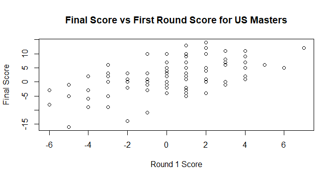

We notice a slightly increasing trend with higher (worse) score on the first round and the final score, which aligns with what the sports journalist says (lower first round score relates to lower final score). The trend looks reasonably linear, so we should try and fit a linear model to the data. Notice that there is also a "year" attribute to the data set, so we should see if this affects the final score in any way before we continue.

``` r
plot(Final~Year,main="Final Score vs Year for US Masters", xlab="Year",
ylab="Final Score",data=Golf.df)
```

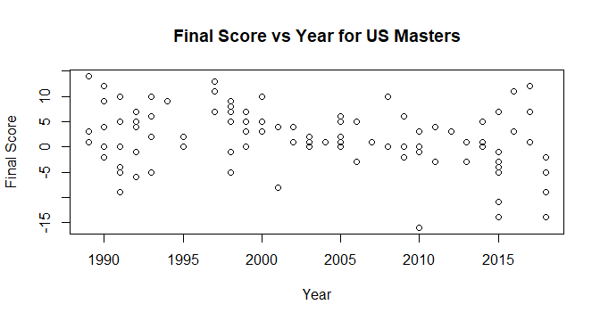

Looking at the final score vs year scatter plot, we see there is no visible significant trend between the year and the final score, so we can continue the investigation without considering the year of which each data point was taken from.

### Fit model and generate output

``` r
# fit the model
Golf.fit <- lm(Final~Round1,data=Golf.df)

# assumption checks
eovcheck(Golf.fit)
```

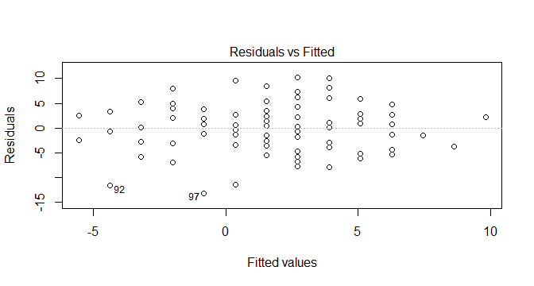

``` r
plot(Golf.fit,which=1) # add trendscatter to observe if there is trend in residuals
```

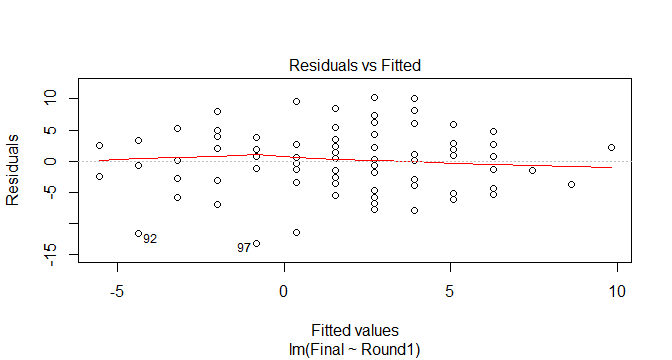

Equality of variance check looks good, reasonably constant scatter of residuals.

``` r
normcheck(Golf.fit)
```

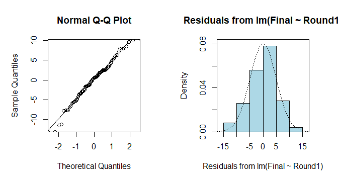

Normality check also looks good, nothing out of the ordinary. Relatively good fit of the normal distribution. Since the sample size is large (100 samples), the normality assumption is satisfied by the central limit theorem.

``` r
cooks20x(Golf.fit)
```

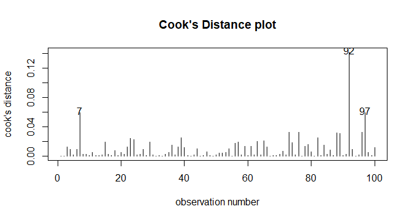

There is no observation of Cook's Distance above 0.4, so it is ok to move on to the next step of the analysis.

``` r
# get summary output and confidence intervals
summary(Golf.fit)
```

    ## 
    ## Call:
    ## lm(formula = Final ~ Round1, data = Golf.df)
    ## 
    ## Residuals:
    ##      Min       1Q   Median       3Q      Max 
    ## -13.1715  -2.9254   0.5536   2.6662  10.2787 
    ## 
    ## Coefficients:
    ##             Estimate Std. Error t value Pr(>|t|)    
    ## (Intercept)   1.5380     0.5019   3.065  0.00282 ** 
    ## Round1        1.1833     0.1902   6.220 1.23e-08 ***
    ## ---
    ## Signif. codes:  0 '***' 0.001 '**' 0.01 '*' 0.05 '.' 0.1 ' ' 1
    ## 
    ## Residual standard error: 5.014 on 98 degrees of freedom
    ## Multiple R-squared:  0.283,  Adjusted R-squared:  0.2757 
    ## F-statistic: 38.69 on 1 and 98 DF,  p-value: 1.225e-08

``` r
confint(Golf.fit)
```

    ##                 2.5 %   97.5 %
    ## (Intercept) 0.5420524 2.533967
    ## Round1      0.8057361 1.560769

### Get predicted output

``` r
predScore.df <- data.frame(Round1=0)
predict(Golf.fit,predScore.df,interval = "prediction")
```

    ##       fit      lwr    upr
    ## 1 1.53801 -8.46098 11.537

We notice that there is a huge difference between the lower and upper estimates of final score based on a first round score of 0 (between -8.5 and to 11.5). This is because we have an R squared of 28%, meaning the fitted model is very bad for prediction. This goes against what the sports journalist says of the first round score being used to give a decent forecast of the overall score.

However, the model itself is not a bad fit due to low p-values, meaning there is still a significant relationship between the first round score and final score. We can change the interval to "confidence" to predict the expected final score with a first round score of 0 to use as a guideline though:

``` r
predict(Golf.fit,predScore.df,interval = "confidence")
```

    ##       fit       lwr      upr
    ## 1 1.53801 0.5420524 2.533967

So for a first round score of par (0), we expect to see , on average, a final score of around 0.5 to 2.5 with 95% confidence.

### Plot with superimposed model

``` r
plot(Final~Round1,main="Final score vs 1st round score for US Masters",sub="(solid line = fitted linear model)",data=Golf.df)
abline(Golf.fit$coefficients[1],Golf.fit$coefficients[2]) # superimpose the linear model
```

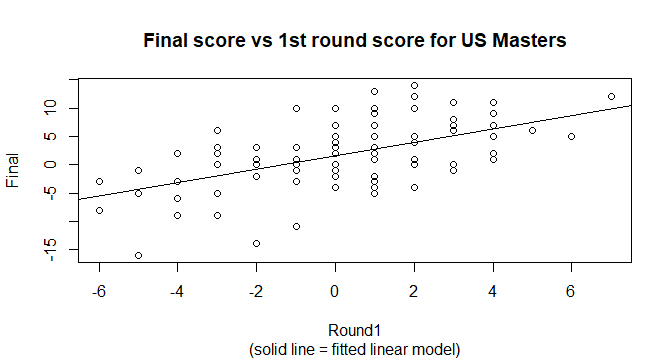

### Method and Assumption Checks

A scatter plot of final vs first round score showed a linear association with approximately constant scatter, so a linear model was fitted.

Even though there is a "Year" attribute to each data point in the Golf dataframe, upon checking the scatter plot of final score vs year, no significant trend was found so we ignored the year of each observation for this investigation.

The eov, normality and linearity assumptions all seem to be satisfied with nothing of major concern. Even though top players tend to compete in the US Masters tournament more than once, we have a large enough data set across many years to be able to rule this out as nothing of major concern. Overall, the models assumptions are satisfied.

Each observation was taking place on the same golf course so there is no factor of location, further increasing our model's validity.

Our final model is: *F**i**n**a**l*<sub>*i*</sub> = *β*<sub>0</sub> + *β*<sub>1</sub> \* *R**o**u**n**d*1<sub>*i*</sub> + *ϵ*<sub>*i*</sub>

where *ϵ*<sub>*i*</sub> ∼ *i**i**d* *N*(0, *σ*<sup>2</sup>).

### Executive Summary

We wanted to find out whether there is a relationship between the performance of professional golf players in the first round of a professional tournament and in the final score. We would also like to know if there is a relationship, how useful is it for prediction? We used data gathered from 100 random players from the US Masters tournament over the last 30 years.

From the statistical investigation, we have evidence to conclude that there is a positive relationship between the first round score and final score - the higher the first round score, the higher the final score and vice versa. So our model has explained that the better golf players do on the first round, the better they do overall.

We estimate that on average, for a first round score of 0, the average final score will be between 0.5 and 2.5, and an increase of between 0.8 to 1.6 in final score for every 1 higher first round score (decrease by 1.6 to 0.8 for every 1 score lower in the first round).

While our model does explain the trend well, it only explains 28% of the variation in final scores. This means that it is extremely bad for prediction of final scores and should not be used for it.

------------------------------------------------------------------------

**Question 2**
--------------

### Get more predicted output

``` r
ScoreRange=seq(-6,7,by=1) # want to predict final round scores of first round scores ranging from -6 to 7
predScore.df <- data.frame(Round1=c(ScoreRange)) # create dataframe holding all first round score values that we would like to predict
MyPreds = predict(Golf.fit,predScore.df,interval = "prediction")
MyPreds[,"lwr"] # display the lower estimate for prediction intervals for each first round score value
```

    ##           1           2           3           4           5           6 
    ## -15.8238502 -14.5622504 -13.3141371 -12.0797709 -10.8593619  -9.6530658 
    ##           7           8           9          10          11          12 
    ##  -8.4609799  -7.2831420  -6.1195289  -4.9700574  -3.8345856  -2.7129162 
    ##          13          14 
    ##  -1.6048001  -0.5099417

This table can be interpreted as the first element having a first round score of -6, the last element having a first round score of 7, increasing in steps of 1. We are looking for first round scores that we can confidently rule out from winning, that is, having a final round score of at least higher than -8. We only need to look at the lower estimate of the prediction interval as we are looking for "at least" -8 in the interval.

By inspecting the output table, we can see elements 8 to 14 (corresponding to a first round score of 1 and above) are above -8 (so -8 is not in the lowest estimate of the prediction interval) meaning we can rule them out. Hence, according to the journalist's claim, competitors with a first round score of 1 and above can be confidently ruled out from winning the tournament.

### Show information on a plot

``` r
xVals <- vector(mode="numeric", length=14) # this vector will hold first round scores
yValsLwr <- vector(mode="numeric", length=14) # this vector will hold the low estimate for prediction of final round scores for corresponding first round scores

for (i in c(seq(1,14,1))){
  xVals[i] = i-7 # first round scores
  yValsLwr[i] = MyPreds[i,2] # obtain lower estimate of prediction interval for corresponding first round score
}

plot(Final~Round1,main="Final Score vs First Round Score for US Masters",sub="(red line = lower estimate of prediction interval for corresponding round 1 score)",xlab="Round 1 Score",
ylab="Final Score",data=Golf.df)
lines(xVals,yValsLwr,col="red") # plot the lower estimate of prediction onto the graph
abline(h=-8,lty=2) # plot a horizontal line at y=-8, corresponding to final score of -8
abline(v=0.4,lty=2) # plot a vertical line at x=0.5, corresponding to a cutoff first round score of 0
```

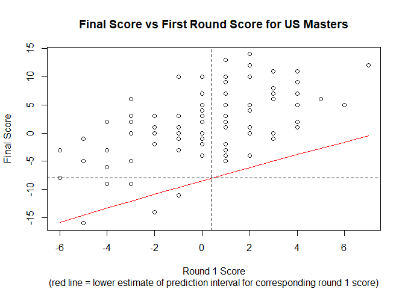

Graphically, we can see that if the winner of the tournament will have a final score that is at least 8 under par, anyone to the right of the vertical line can be confidently ruled out from winning. That is, competitors with a first round score of 1 or above can be confidently ruled out from winning.

------------------------------------------------------------------------

**Question 3**
--------------

### Question of interest/goal of the study

A film archivist would like a fast method to determine the length of a film using how much film is on the reel. We want to find out if there is a relationship between the diameter of film on a reel and its length, and if there is, can we build a model to fit it and what is the equation of this model. We also want to know if the model is useful for prediction, and in particular we would like to predict the length of a film which has an 8.4 inch diameter on the reel.

### Read in and inspect the data:

``` r
Film.df=read.table("film1.txt",header=TRUE)
head(Film.df)
```

    ##   Length Diameter
    ## 1    226      5.1
    ## 2    241      5.4
    ## 3    255      5.6
    ## 4    293      5.9
    ## 5    308      6.2
    ## 6    326      6.6

``` r
plot(Length~Diameter,main="Length vs Diameter of Film", xlab="Diameter of Film (inches)",
ylab="Length of Film (feet)",data=Film.df)
```

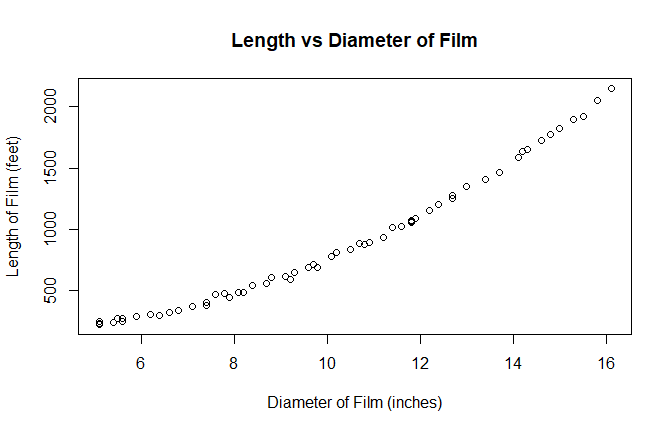

We can see a positive trend in the length vs diameter of film, so let us naively try and fit a linear model to the data, even though it appears to have a quadratic relationship.

### Fit model and generate output

``` r
# fit the linear model
Film.fit <- lm(Length~Diameter,data=Film.df)

# check residuals
plot(Film.fit,which=1)
```

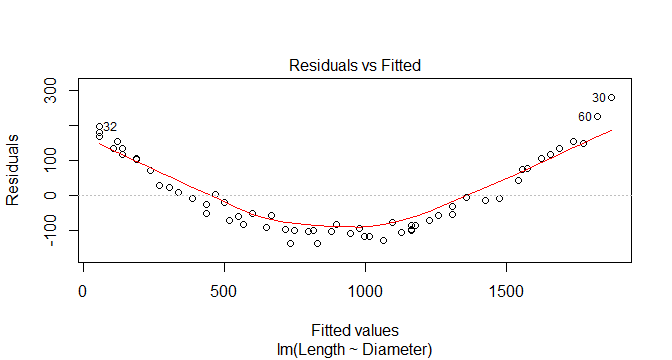

We see a very obvious quadratic trend in the residuals, so let us now try and fit a quadratic model to the data set to aim for a better fit.

``` r
# fit the quadratic model
Film2.fit <- lm(Length~Diameter+I(Diameter^2),data=Film.df)

# assumption checks
plot(Film2.fit,which=1)
```

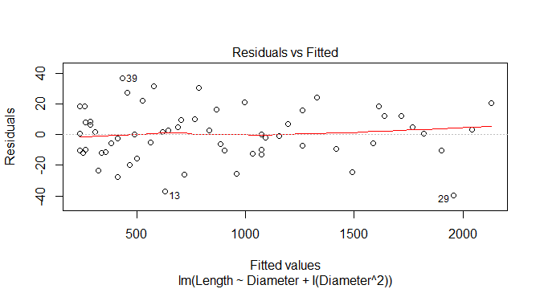

Now we see a reasonably constant scatter of residuals, so eov check is good.

``` r
normcheck(Film2.fit)
```

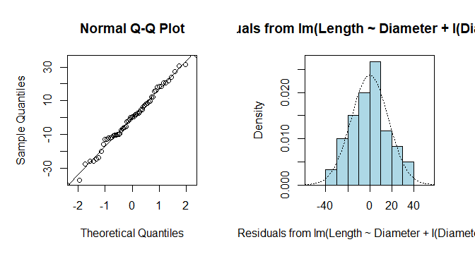

Again, nothing out of the ordinary for normchecks, with a relatively good fit of the normal distribution. We have sample size of 60 so normality assumption can be satisfied with the CLT.

``` r
cooks20x(Film2.fit)
```

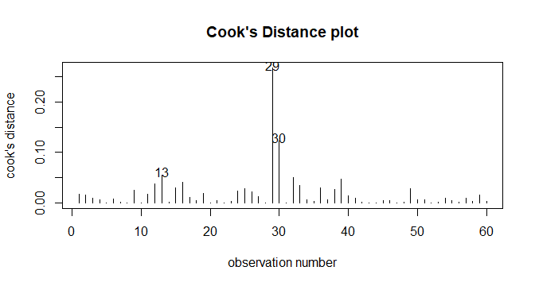

No points above Cook's Distance above 0.4, so it is ok to move on to next step of analysis.

``` r
# get summary output and confidence intervals
summary(Film2.fit)
```

    ## 
    ## Call:
    ## lm(formula = Length ~ Diameter + I(Diameter^2), data = Film.df)
    ## 
    ## Residuals:
    ##     Min      1Q  Median      3Q     Max 
    ## -39.701 -10.280   0.276  10.392  36.801 
    ## 
    ## Coefficients:
    ##               Estimate Std. Error t value Pr(>|t|)    
    ## (Intercept)   261.6349    22.8622   11.44   <2e-16 ***
    ## Diameter      -60.9772     4.7335  -12.88   <2e-16 ***
    ## I(Diameter^2)  10.9936     0.2281   48.20   <2e-16 ***
    ## ---
    ## Signif. codes:  0 '***' 0.001 '**' 0.01 '*' 0.05 '.' 0.1 ' ' 1
    ## 
    ## Residual standard error: 17.09 on 57 degrees of freedom
    ## Multiple R-squared:  0.999,  Adjusted R-squared:  0.999 
    ## F-statistic: 2.992e+04 on 2 and 57 DF,  p-value: < 2.2e-16

We can see the coefficients of the quadratic model in the summary:

The exact estimated model equation is: *L**e**n**g**t**h* = 261.6349 − 60.9772 \* *D**i**a**m**e**t**e**r* + 10.9936 \* *D**i**a**m**e**t**e**r*<sup>2</sup> + *r**e**s**i**d**u**a**l*

### Get predicted output

``` r
predLength.df <- data.frame(Diameter=8.4)
predict(Film2.fit,predLength.df,interval="prediction")
```

    ##       fit      lwr      upr
    ## 1 525.135 490.4162 559.8538

Here we have no issue using the "prediction" interval as our model has an R squared of 99.9% (excellent for prediction in the given range of the data).

### Plot with superimposed model

``` r
# generate series of fitted values for plot
xfit = seq(5,16,0.1)
yfit = Film2.fit$coefficients[1]+Film2.fit$coefficients[2]*xfit+Film2.fit$coefficients[3]*xfit^2

# plot a scatter plot and the superimposed quadratic curve
plot(Length~Diameter,main="Length vs Diameter of Film",sub="(solid line = fitted quadratic model)",data=Film.df)
lines(xfit,yfit)
```

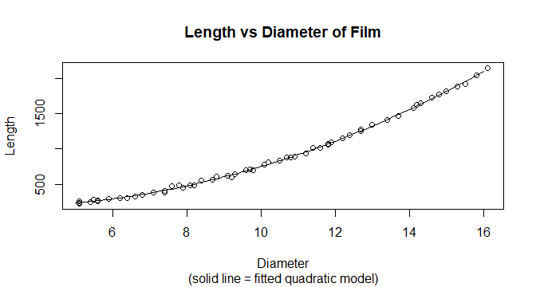

### Method and Assumption Checks

A linear model was fitted to the data at first, but not surprisingly it didn't fit well as the data appeared to have a quadratic trend.

After fitting a quadratic model instead, residuals were fine and there were no problems with normality and no points of unduly influence. We have independence because the length of each film is not dependent on any other films, and they are all on the same type of reel. Overall, the models assumptions are satisfied.

One consequence of this model is that we can no longer interpret the confidence intervals as a one unit change in the diameter.

Our final model is *L**e**n**g**t**h*<sub>*i*</sub> = *β*<sub>0</sub> + *β*<sub>1</sub> \* *D**i**a**m**e**t**e**r*<sub>*i*</sub> + *β*<sub>2</sub> \* *D**i**a**m**e**t**e**r*<sub>*i*</sub><sup>2</sup> + *ϵ*<sub>*i*</sub>

where *ϵ*<sub>*i*</sub> ∼ *i**i**d* *N*(0, *σ*<sup>2</sup>).

### Executive Summary

We were interested in finding out if there was a relationship between the diameter of film on a reel and the film's length. We'd also like to know how useful the relationship is for prediction if there is one. Data was gathered from a random sample of 60 same-type film reels.

We have evidence that there is a positive relationship between the diameter of a film on the reel and its length. The rate of increase is not constant - it is higher as the diameter of the film gets larger.

Our model explains nearly 100% of the variation in the data. This makes it excellent for predicting the length of films based on their diameter on the reel. Using our model, we predict that a film with diameter of 8.4 inches will have a length between 490 and 560 feet.
